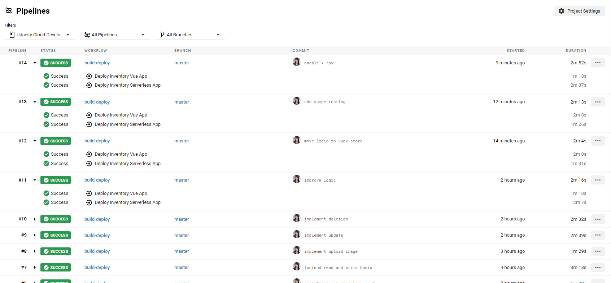

### Udacity Inventory Management App

[](https://github.com/xndong1020/Udacity-Cloud-Developer-Capstone)

#### How to run

**back-end (serverless restful api)**

```sh
cd backend
npm i

# for unit tests
npm test

# for deployment
sls deploy -v
```

**frontend (Vue.js)**

```sh
cd client
npm i

# for linting
npm run lint

# for unit tests
npm test

# for local development, dev server will be listening on port 3000
npm start
```

**Demo website** is [here](http://my-cloud-dev-s3.s3-website-us-west-2.amazonaws.com/)

#### Endpoints

- GET - https://1yluq7f665.execute-api.us-west-2.amazonaws.com/dev/inventory
- POST - https://1yluq7f665.execute-api.us-west-2.amazonaws.com/dev/inventory
- PATCH - https://1yluq7f665.execute-api.us-west-2.amazonaws.com/dev/inventory/{inventoryId}
- DELETE - https://1yluq7f665.execute-api.us-west-2.amazonaws.com/dev/inventory/{inventoryId}
- POST - https://1yluq7f665.execute-api.us-west-2.amazonaws.com/dev/inventory/{inventoryId}/attachment

#### For backend testing, please use postman collection file attached.

`serverless-inventory-management.postman_collection`

#### pipeline using circleci



